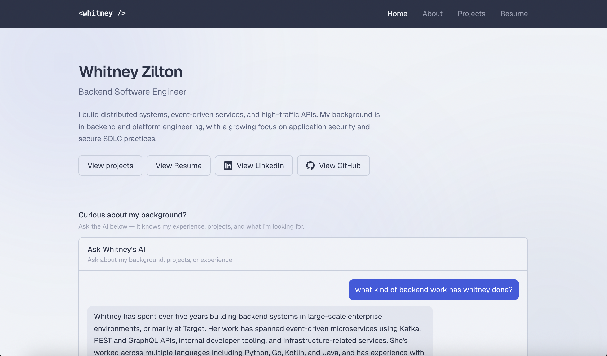

# Web Portfolio

A personal portfolio website built with Next.js, TypeScript, and Tailwind CSS.

This site is a home for my projects, technical background, and resume. It reflects my interests in backend engineering, secure software development, and building thoughtful developer-facing experiences.

It also includes an AI chat panel that can answer questions about my experience and skills.

**Live:** https://ziltonportfolio.io

## Preview


## Features
- Landing page with AI-powered chat experience
- About page
- Projects page
- Resume viewer

## Tech Stack
- **Next.js 14**
- **TypeScript**
- **Tailwind CSS**
- **Anthropic API**

## Running Locally
```bash
npm install
cp .env.local.example .env.local
npm run dev
```

Add your API key to `.env.local` and place your resume PDF at:

```text
public/resume.pdf
```

